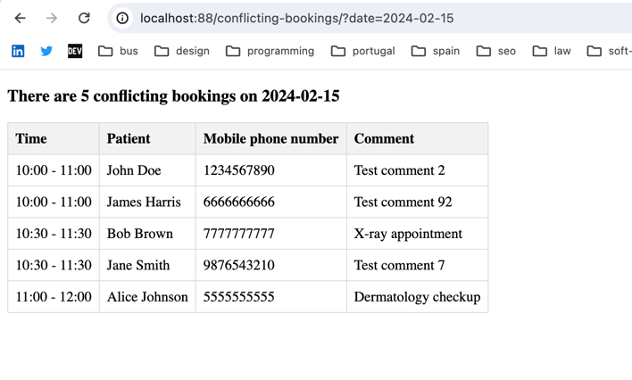

# test_intersections
test task

## Setup
`make install`

http://localhost:88/ - site

http://localhost:8081/ - adminer

# Database dump
```mysql
CREATE TABLE patient (
						 id INT AUTO_INCREMENT PRIMARY KEY,
						 name VARCHAR(255) NOT NULL,
						 mobile_phone VARCHAR(20) NOT NULL
);

CREATE TABLE booking (
						 id INT AUTO_INCREMENT PRIMARY KEY,
						 patient_id INT NOT NULL,
						 booking_date DATE NOT NULL,
						 start_time TIME NOT NULL,
						 end_time TIME NOT NULL,
						 comment TEXT,
						 FOREIGN KEY (patient_id) REFERENCES patient(id)
);

INSERT INTO patient (name, mobile_phone) VALUES
											 ('John Doe', '1234567890'),
											 ('Jane Smith', '9876543210'),
											 ('Alice Johnson', '5555555555'),
											 ('Bob Brown', '7777777777'),
											 ('Emma Wilson', '9999999999'),
											 ('Michael Clark', '1111111111'),
											 ('Sarah Lee', '2222222222'),
											 ('David White', '3333333333'),
											 ('Olivia Taylor', '4444444444'),
											 ('James Harris', '6666666666');

INSERT INTO booking (patient_id, booking_date, start_time, end_time, comment) VALUES
																				  (1, '2024-03-10', '09:00:00', '10:00:00', 'Booked for consultation'),
																				  (2, '2024-03-10', '10:00:00', '11:00:00', 'Follow-up appointment'),
																				  (3, '2024-03-10', '11:00:00', '12:00:00', 'Routine checkup'),
																				  (4, '2024-03-10', '12:00:00', '13:00:00', 'Dental cleaning'),
																				  (5, '2024-03-10', '13:00:00', '14:00:00', 'Eye examination'),
																				  (6, '2024-03-10', '14:00:00', '15:00:00', 'Physical therapy'),
																				  (7, '2024-03-10', '14:30:00', '15:30:00', 'MRI scan'),
																				  (8, '2024-03-10', '16:00:00', '17:00:00', 'Ultrasound'),
																				  (9, '2024-03-10', '17:00:00', '18:00:00', 'X-ray'),
																				  (10, '2024-03-10', '18:00:00', '19:00:00', 'Blood test');

CREATE INDEX idx_patient_name ON patient (name);
CREATE INDEX idx_booking_booking_date ON booking (booking_date);

```

## Run tests
`make test`

### Result
